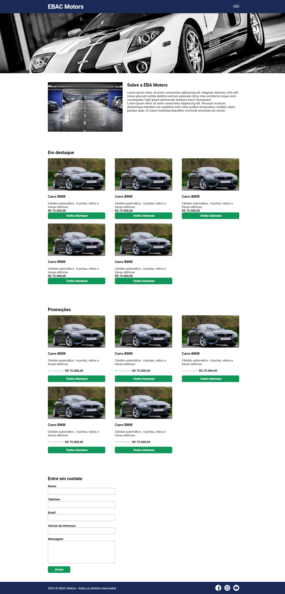

# EBAC Motors

Este é o projeto EBAC Motors, um site fictício para uma concessionária de automóveis. Aqui está uma visão geral do projeto e como utilizá-lo.

## Projeto

## Conteúdo

- [EBAC Motors](#ebac-motors)
  - [Projeto](#projeto)
  - [Conteúdo](#conteúdo)
  - [Visão Geral](#visão-geral)
  - [Como Usar](#como-usar)
  - [Pré-requisitos](#pré-requisitos)
  - [Instalação](#instalação)
  - [Tecnologias Utilizadas](#tecnologias-utilizadas)
  - [Deploy](#deploy)

## Visão Geral

O EBAC Motors é um projeto fictício desenvolvido em HTML, CSS e jQuery. Ele representa um site de uma concessionária de automóveis, fornecendo informações sobre a empresa, destaques de veículos, promoções e uma seção de contato.

## Como Usar

1. Navegue pelo site usando o menu de navegação.
2. Confira os destaques e promoções de veículos.
3. Para obter mais informações ou manifestar interesse em um veículo, preencha o formulário na seção "Entre em Contato".

## Pré-requisitos

- Navegador web compatível com HTML5, CSS3 e jQuery.

## Instalação

1. Clone o repositório para o seu computador.
2. Abra o arquivo `index.html` em seu navegador.

## Tecnologias Utilizadas

- HTML5
- CSS3
- jQuery
- Slick Carousel
- jQuery Mask
- jQuery Validate

## Deploy

Veja o projeto em ação [aqui](https://ebac-motors-nine.vercel.app/).

---

**Desenvolvido por [Kathleen]**
